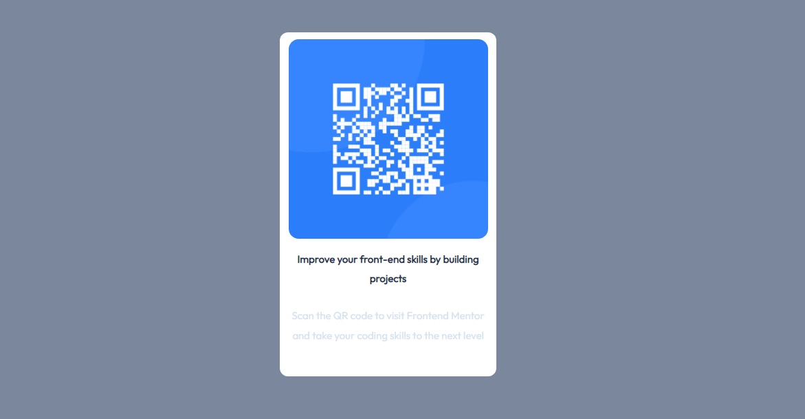

# Frontend Mentor - QR code component solution

This is a solution to the [QR code component challenge on Frontend Mentor](https://www.frontendmentor.io/challenges/qr-code-component-iux_sIO_H). Frontend Mentor challenges help you improve your coding skills by building realistic projects. 

## Table of contents

- [Overview](#overview)
  - [Screenshot](#screenshot)
  - [Links](#links)
- [My process](#my-process)
  - [Built with](#built-with)
  - [What I learned](#what-i-learned)
  - [Continued development](#continued-development)
- [Author](#author)

## Overview
QR-Code component by frontend mentors was quite easy and aided the learning of flexbox for me.
### Screenshot

### Links

- Solution URL: [Add solution URL here](https://your-solution-url.com)
- Live Site URL: [Add live site URL here](https://your-live-site-url.com)

## My process
I started with HTML5 structure, by creating containers for my flex and identifying what needed to be flex items, using the style guide, I got colors and typography, the sizes of the boxes were somewhat difficult to come by.
### Built with

- Semantic HTML5 markup
- CSS custom properties
- Flexbox
- Mobile-first workflow

### What I learned

This challenge aided my knowlege of css flexbox and I was able to use it to position the components

### Continued development

I'm getting comfortable wih css flexbox and I intend to advance to css grid soon

## Author

- Frontend Mentor - [@jikkeee](https://www.frontendmentor.io/profile/jikkeee)
- Twitter - [@jaekralj](https://www.twitter.com/jaekralj)
